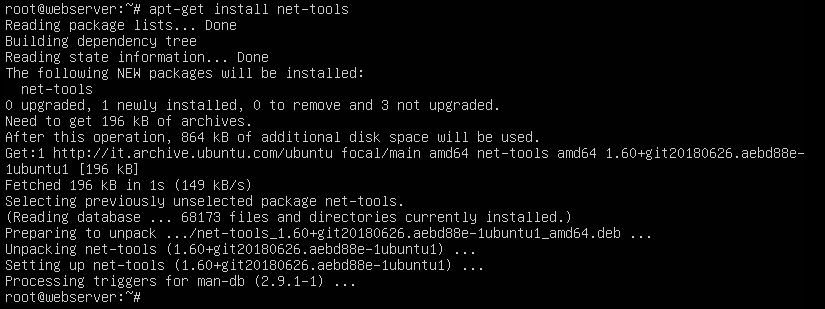
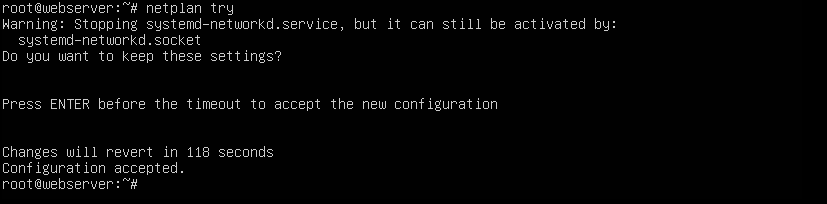
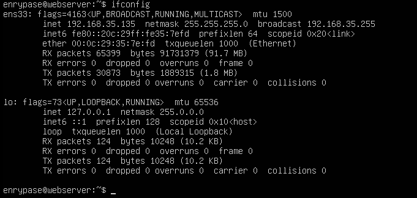
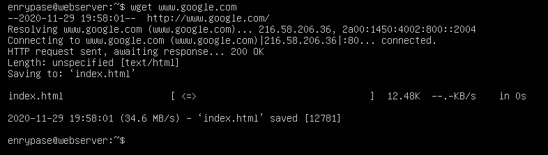

<!-- Il documento è suddiviso in Passi;
In ogni passo c'è la sezione Comandi e la sezione Checkpoint;
Ognuna di queste sezioni contiene tutti i comandi necessari a portare a termine l'obiettivo del determinato passo, se nella sezione Comandi, oppure a controllare l'operato, se nella sezione Checkpoint;
In ogni comando è contenuta una descrizione di esso, se non riguarda un file, l'immagine dell'invio del comando con il relativo output dalla macchina, altrimenti è presente un link al file del quale si sta parlando.

Enjoy!! -->

# DOCUMENTAZIONE WEB-SERVER

## PROCESSO DI INSTALLAZIONE

### **Passo 1:**
Il primo passo per configurare un server web è quello di assegnare a esso un IP statico, in modo tale che si possa raggiungere agevolmente e sempre con lo stesso indirizzo la determinata macchina;

- **Comandi:** :computer:  
Per l'eseguzione dei seguenti comandi è necessario che l'utente sia **root**.

> ***apt-get install net-tools***  
:diamonds: Descrizione:  
_Questo comando permetterà l'installazione di tools utili per la verifica dello stato del network e delle varie interfacce di rete._  
:diamonds: Immagine:  

> ***nano /etc/netplan/00-installer-config.yaml***  
:diamonds: Descrizione:  
_Con questo comando, invece, andremo ad aprire il file di testo "00-installer-config.yaml" dove ci sono le varie configurazioni di rete della macchina._  
:diamonds: File di esempio: [File](https://github.com/Enrypase/WEB-SERVER/blob/main/00-installer-config.yaml)

> ***netplan try***  
:diamonds: Descrizione:  
_Questo comando, più avanzato rispetto a ***netplan apply*** permette di verificare la correttezza semantica del file modificato in precendeza. Se tutto dovesse risultare corretto sarà possibile applicare le modifiche premendo invio._  
:diamonds: Immagine:  

- **Checkpoint:** :heavy_exclamation_mark:  
I seguenti passi saranno utili per confermare l'effettivo esito dei passaggi sopra eseguiti.

> ***ifconfig***  
:diamonds: Descrizione:  
_Con questo comando verranno visualizzate tutte le interfacce di rete. Basterà quindi verificare che quella interessata abbia l'indirizzo IP inserito in precedenza per vedere se le impostazioni sono state applicate correttamente e definitivamente. Potremmo utilizzare anche il comando **ip addr**._  
:diamonds: Immagine:  

> ***wget www.google.com***  
:diamonds: Descrizione:  
_Questo comando è preferibile a ***ping [indirizzo]*** essendo che i pacchetti di quest'ultimo potrebbero essere scartati dai router, mentre quelli FTP inviati tramite wget no. Se la richiesta del sito (in questo caso Google) va a buon fine, significa che l'indirizzo inserito nei file di configurazione è compatibile con la nostra rete e permette la navigazione nel World Wide Web._  
:diamonds: Immagine:  

### **Passo 2:**
In questo passo andremo a installare un client che permette l'accesso SSH alla macchina. Così facendo questa sarà raggiungibile da tutte le altre macchine presenti in rete;

- **Comandi:** :computer:  
Per l'eseguzione dei seguenti comandi è necessario che l'utente sia **root**.

> ***apt-get install openssh-server***  
_Una volta fatto questo il servizio dovrebbe già essere attivo e, di conseguenza, la macchina dovrebbe già permettere l'accesso tramite SSH_

- **Checkpoint:** :heavy_exclamation_mark:  
I seguenti passi saranno utili per confermare l'effettivo esito dei passaggi sopra eseguiti.

> ***systemctl status ssh.service***  
_Questo comando permette la visualizzazione dello stato del processo relativo a SSH. Altri comandi utili potrebbero essere ***netstat*** oppure ***ps***_

### **Passo 3:**
In questo passo effetueremo l'installazione di Apache Server;

- **Comandi:** :computer:  
Per l'eseguzione dei seguenti comandi è necessario che l'utente sia **root**.

> ***apt-get install apache2***  
_Con questo comando verrà installato il web-server Apache_

- **Checkpoint:** :heavy_exclamation_mark:  
I seguenti passi saranno utili per confermare l'effettivo esito dei passaggi sopra eseguiti.

> ***systemctl status apache2.service***  
_Questo comando permette la visualizzazione dello stato del processo relativo ad Apache (Web-Server). Altri comandi utili potrebbero essere ***netstat*** oppure ***ps***_

### **Passo 4:**
In questo passo installeremo il client FTP in modo tale da permettere tale accesso sulla macchina e, di conseguenza, poter modificare e trasferire files da macchine in rete alla macchina soggetta;

- **Comandi:** :computer:  
Per l'eseguzione dei seguenti comandi è necessario che l'utente sia **root**.

> ***apt-get install vsftpd***  
_Con questo comando verrà installato il client FTP vsftpd_

> ***nano /etc/vsftpd.conf***  
_File di esempio: [File](https://github.com/Enrypase/WEB-SERVER/blob/main/vsftpd.conf)_

> ***systemctl reload vsftpd.service***  
_Con il comando sopra stante potremo riavviare il servizio, così facendo verranno applicate le impostazioni appena modificate senza dover per forza fare un reboot_

- **Checkpoint:** :heavy_exclamation_mark:  
I seguenti passi saranno utili per confermare l'effettivo esito dei passaggi sopra eseguiti.

> ***systemctl status vsftpd.service***  
_Questo comando permette la visualizzazione dello stato del processo relativo a vsftpd (FTP). Altri comandi utili potrebbero essere ***netstat*** oppure ***ps***_

### **Passo 5:**
**(Opzionale ma fortemente consigliato)** Per l'installazione di un Web-Server è preferibile che ogni utente abbia a disposizione una determinata zona del File-System della macchina.
Per fare ciò bisogna creare degli utenti i quali possiedono una determinata home (diversa da quella del root) contenente tutti i file dei quali l'utente potrebbe necessitare. In questo caso i file di Log e i vari HTML, CSS, Script, file multimediali eccetera eccetera;

- **Comandi:** :computer:  
Per l'eseguzione dei seguenti comandi è necessario che l'utente sia **root**.

> ***useradd -s /bin/bash -d [homeDirectory] -m [nomeUtente]***  
_Comando che permette la creazione di un utente. Con **-s** diamo a disposizione dell'utente la **bash**; con **-d** diamo all'utente una **home directory**; con **-m** diamo il **nome** dell'utente

> **passwd [nomeUtente]**  
_Una volta  dato l'invio verrà richiesto all'utente di assegnare una password all'utente inserito. Quindi, è necessario re-inserire la stessa password due volte di seguito accertandosi che siano uguali e corrette_

- **Checkpoint:** :heavy_exclamation_mark:  
I seguenti passi saranno utili per confermare l'effettivo esito dei passaggi sopra eseguiti.

> ***Accesso tramite FTP-Client***  
_Per verificare che l'utente sia stato creato effettivamente si può tentare l'accesso tramite client FTP, nel caso in cui ci fossero dei problemi con dei permessi nel trasferimento, bisogna tornare sulla macchina e digitare ***chown -R [nomeUtente]:[nomeUtente] [directoryCartella]***.
Se nonostante questo ci fossero comunque dei problemi con dei permessi bisogna eseguire il seguente comando: ***chmod +rwx [directoryCartella]***.
Se ci fossero comunque problemi bisogna controllare il file di configurazione di vsftpd (FTP)_

### **Passo 6:**
Qui finiremo la configurazione del Web-Server andando a configurare Apache;

- **Comandi:** :computer:  
Per l'eseguzione dei seguenti comandi è necessario che l'utente sia **root**.

> ***nano /etc/apache2/sites-avaiable/default-ssl.conf***  
_File di esempio: [File](https://github.com/Enrypase/WEB-SERVER/blob/main/000-default.conf)  
Modificare il file in base alle proprie necessità. Le tre voci principali da modificare sono ***ServerName*** che contiene la URL del sito, ***DocumentRoot*** che contiene la posizione del sito nel FileSystem, ***ErrorLog*** dove deve essere indicata la posizione per i file di log relativi agli errori e ***CustomLog*** dove deve essere indicata la posizione per i file di log relativi agli accessi, richieste e altre operazioni.  
***ATTENZIONE, è preferibile, però, lavorare su un altro file e non direttamente su quello di default_***

> ***a2ensite [nomeFile]***  
_Con questo comando si abilita il sito_

> ***systemctl reload apache2***  
_Con questo comando verrà riavviato il servizio di Apache, in modo tale da rendere i cambiamenti effettivi  
Se il riavvio andrà a buon fine non verrà visualizzato alcun messaggio di errore, altrimenti sarà segnalato un problema_

- **Checkpoint:** :heavy_exclamation_mark:  
I seguenti passi saranno utili per confermare l'effettivo esito dei passaggi sopra eseguiti.

> ***journalctl -xe***  
_Con questo comando sarà possibile vedere i log del sistema che comprendono anche il riavvio di Apache. In caso di problemi, tutti i possibili errori che impediscono l'avvio di Apache verranno segnalati qui_

> ***Raggiungere la pagina dal browser***
_Per verificare se il sito è raggiungibile, il modo più semplice e rapido è quello di provare a raggiungerlo da un browser qualsiasi. Se il sito comparirà significa che tutte le operazioni sono andate a buon fine. In caso di errori bisognerà controllare nuovamente i file di configurazione del sito_

### NOTA:  
*Si consiglia di effettuare tutte le operazioni rispettando l'ordine con le quali sono state esposte*  
